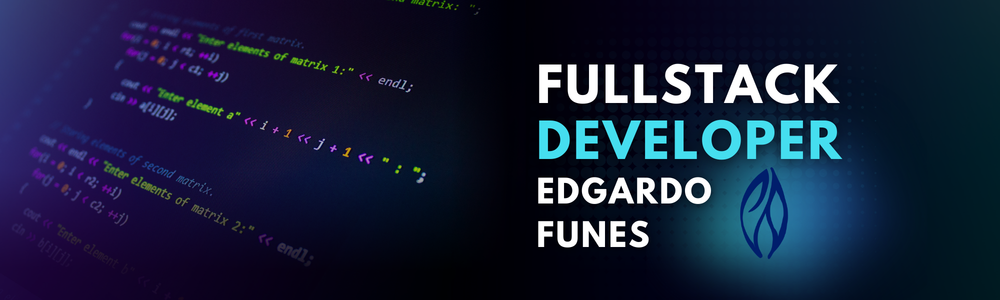

# Hola, Soy Edgardo Funes! 👋

## 🚀 Sobre mi
¡Hola! Soy Edgardo Funes, un apasionado Full Stack Developer con un sólido background en desarrollo de aplicaciones Java y aplicaciones web, desde el Back-end hasta el Front-end. A lo largo de mi trayectoria, he adquirido habilidades que me han permitido trabajar en equipo de manera efectiva, resolver errores de manera eficiente y adaptarme rápidamente a nuevas tecnologías.  
Mi especialización se centra en el Front-end, donde tengo una amplia experiencia en el desarrollo de aplicaciones web utilizando Javascript, React, Node y Next. Estoy constantemente actualizándome y aprendiendo nuevas tecnologías de forma independiente para mantenerme al día en un campo en constante evolución.  
Además, poseo sólidos conocimientos en metodologías ágiles como Scrum, así como en el uso de herramientas de control de versiones como GIT. También tengo experiencia en la implementación de estructuras de datos y algoritmos eficientes para optimizar el rendimiento de las aplicaciones.  
En el ámbito del diseño y estilización, estoy familiarizado con varios frameworks CSS, bibliotecas y dependencias que me permiten crear interfaces atractivas y responsivas.
Mi enfoque se caracteriza por un pensamiento analítico, la gestión efectiva del tiempo y un deseo constante de aprendizaje y mejora continua. Estoy comprometido en ofrecer soluciones de calidad y satisfacer las necesidades de los usuarios finales.
Además de mis habilidades técnicas, poseo un nivel intermedio de inglés, lo que me permite comunicarme eficientemente en entornos internacionales y colaborar con equipos de diferentes culturas.  
Estoy entusiasmado por enfrentar nuevos desafíos y contribuir al éxito de proyectos emocionantes. Siempre estoy abierto a colaboraciones y oportunidades de crecimiento profesional. ¡No dudes en contactarme para discutir cómo podemos trabajar juntos y crear soluciones innovadoras!  

¡Gracias por visitar mi perfil!

## 🔵 Tech Stack

**Lenguajes** 

**Client**  

**Server**  

**Otros**  

## 🔗 Links

## 💬 Contacto
🔔edgar.funes2001@gmail.com 
🔔+54 9 261 618-7293

## 🤟 Stats
  

